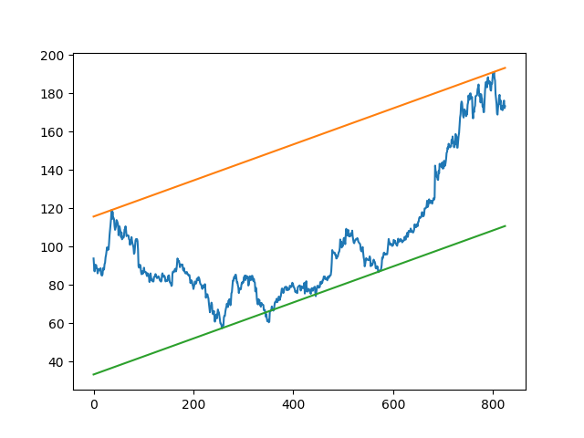
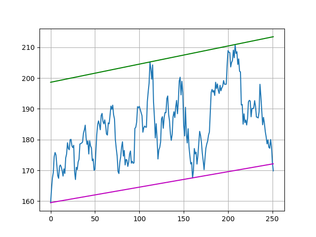
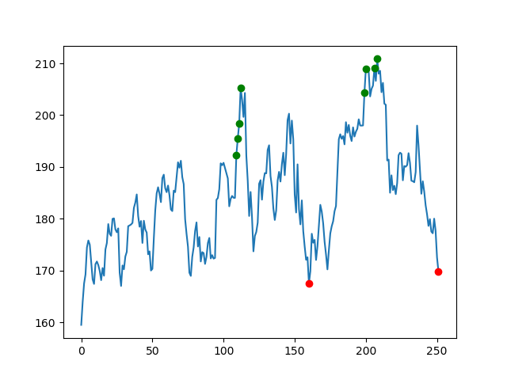

## TrendLine

Edit these lines to modify the amount of data you wish to draw trendlines for.
You can also change the ticker symbol from "BABA" to any other stock. 


```python
today = datetime.now()
d = timedelta(days=365)
start = today - d
dat = data.DataReader("BABA", "iex", start, today)['close']
```


Run the file: **python TrendLine.py** 

Results from Alibaba's stock data for past year. 







