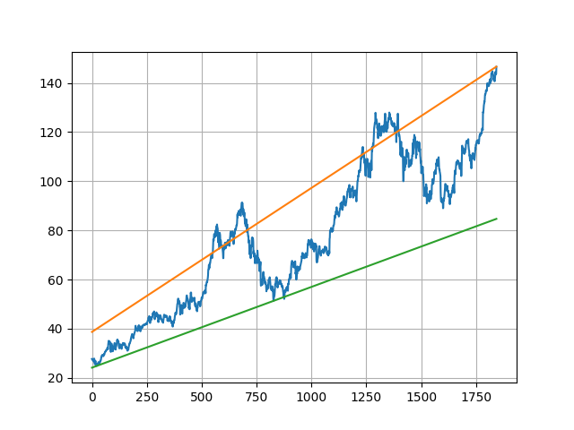
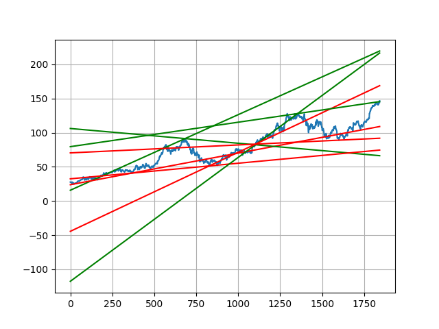
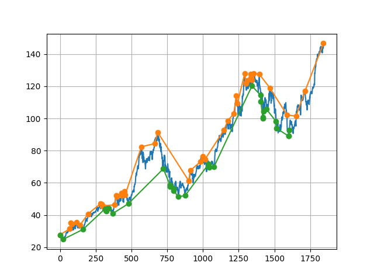
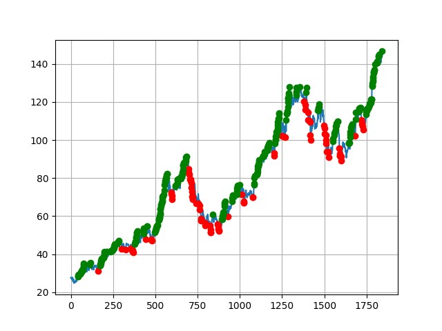
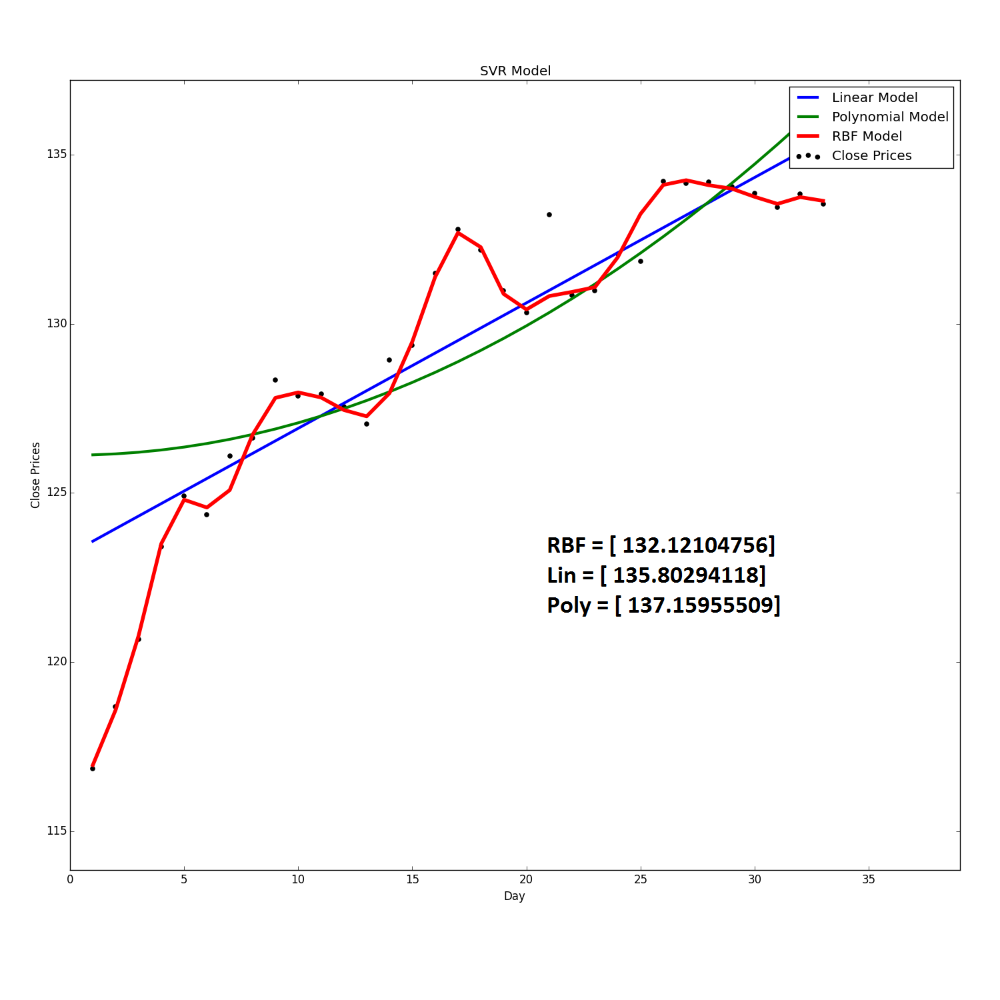

# Stock Analysis

This repository contains python scripts that I am devleoping to perform analysis on stock prices and visualization of stock prices and other data such as volume.  

Some of the goals I want to achieve with this project include: 
  - Get the data I need from Yahoo Finance or other API. Able to specify what I need and the time range. 
  - Different regression implementations on the close price data. (Linear, SVM, etc.) Possibly try to fit a polynomial function which follows the data.  
  - Predicting Stock price for the next day. 


## Trends

TrendLine.py Results











## Regression

Using my code for linear regression and Nvidia's (NVDA) stock prices of each day. I got a slope of 0.1850399032986727 and a y intercept of 24.54867003005582. The 50.08 number is the price predicted for the next day based on the linear formula it calculated.

```python
[0.1850399032986727, 24.54867003005582]
50.0841766853
```

### Screenshots


#### New Screenshots 

#### AEIS

#### FB



## Version

1.0.0 - Released Stock Scraper

1.0.1 - Minor bug fixes with duplicate entries in the CSV File


### Todo

- Use Machine Learning algorithms to predict stock close price for the next day
- Add data visualization with technical indicators such as moving average, volume, STOCH. 
- Display technical analysis based on stock prices. 
- Add Ratio Analysis & compare ratio with competitors' ratios. (Allow users to define competitors' ratios)
- Add Stock screener, to screen through every stock and see which ones are best buys.


#### License

MIT

**Free Software, Hell Yeah!**

